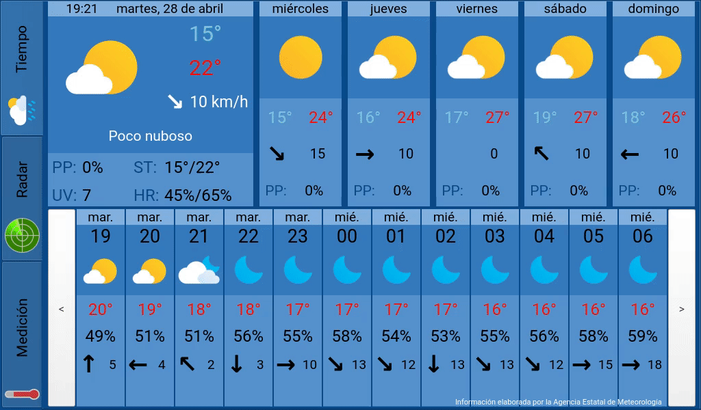

# Pi Weather Hub

Pi Weather Hub is a Python GUI Application made to display weather data from Spain's State Meteorological Agency [AEMET](https://www.aemet.es), as well as temperature, humidity and pressure measurements from a special Google spreadsheet and a SHT31-D sensor.

This app is designed for a Raspberry Pi 3 Model B+ connected to a 1024x600 touchscreen, although you can probably run *most* of it (see [Features](#Features)) on any device with similar or higher specs and Python 3.7 or later.

### Legal notice
This is NOT an official app from AEMET. AEMET, as owner of the reused information, does NOT participate, sponsor or support the reuse that is carried out with this app or the app itself. The forecast data displayed within this app should always be the latest available.

### Features 


This app is divided into three different tabs:
* **Forecast (_Tiempo_):** It presents the weather forecast for the next few days at the upper half, while at the lower half the hourly forecast is displayed. It is possible to scroll through the hourly forecast using the buttons at the sides. The information displayed within this tab it's fetched from [AEMET's API](https://opendata.aemet.es) and the location by default is [Málaga](http://www.malagaturismo.com/en).
* **Radar:** It displays national and regional radar pictures and their approximate timestamp. Radar pictures from the last 2 hours can be displayed in a loop using the Animation button.
* **Measurements (_Medición_):** This tab presents measured temperature, relative humidity and pressure data. The latest value is displayed, as well as maximum and minimum values from the last 24 hours and plots with data from the last 7 days. These values come from two different sources:
  * **Interior:** An [Adafruit Sensirion SHT31-D](https://www.adafruit.com/product/2857) sensor attached to the Raspberry Pi.
  * **Exterior:** A Google spreadsheet where data is posted periodically by a weather station I made some time ago.

As the measurements functions probably are not especially useful to most people, they can easily be disabled (see [Installation](#Installation)).

## Prerequisites
### Forecast functionality (required)
First, we need to install [PyQt5](https://www.riverbankcomputing.com/software/pyqt/download5). In my experience, the easiest way to do so on a RPi is:

```bash
sudo apt-get install python3-pyqt5
```

Then use the package manager [pip](https://pip.pypa.io/en/stable/) to install the following packages:

```bash
pip3 install numpy matplotlib
pip3 install requests
```
You will need an API Key for AEMET's API. To obtain it, visit [AEMET OpenData](https://opendata.aemet.es)'s website, select *Solicitar* on *Obtención de API Key* an enter your email.

### Measurements functionality (optional)
#### Google Sheets integration
The Sheets module expects a spreadsheet with the following format:
| Timestamp | Temperature (°C) | Humidity (%) | Pressure (Pa) |
| :---: | :---: | :---: | :---: |
| 4/29/2020 12:16:28 | 22.6 | 40.5 | 101666.34 |
| 4/29/2020 12:01:27 | 22.5 | 41.7 | 101668.81 |
| ... | ... | ... | ... |

In order to use Google's API to fetch data from it, first you will need to enable the API in your Google account and download a `credentials.json` file. To do so, follow [these steps](https://developers.google.com/sheets/api/quickstart/python#step_1_turn_on_the).

Then run the following command to install the library using pip:
```bash
pip3 install --upgrade google-api-python-client google-auth-httplib2 google-auth-oauthlib
```
#### SHT31-D sensor integration
Carefully follow [Adafruit's tutorial](https://learn.adafruit.com/adafruit-sht31-d-temperature-and-humidity-sensor-breakout/python-circuitpython#python-installation-of-sht31d-library-5-6) on how to install the sensor and the necessary libraries.

## Installation
Clone the repository with git (or click the *Download ZIP* button on this page and unpack it):
```
git clone https://github.com/frios94/Pi-Weather-Hub.git
```
If you want a forecast only installation, edit the following line on [`main.py`](pi_weather_hub/main.py):
```
MEASUREMENTS_INTEGRATION_ACTIVATED = True
```
Changing its value to `False`. Otherwise leave it as is.
### Forecast functionality (required)
Create a Python file inside [`pi_weather_hub/forecast_worker`](pi_weather_hub/forecast_worker) named `_aemet_api_key.py`. Open it, add this line with the appropriate value and save it:
```
AEMET_API_KEY = "YOUR_API_KEY_GOES_HERE"
```
Additionally, unless you live at Málaga, you probably want to change theses values in `aemet_updater.py`:
```
MUNICIPIO_ID = "29067"
RADAR_ID = "ml"
```
You can find more information about them in [AEMET OpenData documentation](https://opendata.aemet.es/dist/index.html).

Finally, if your screen has a bigger resolution than 1024x600, the GUI will scalate very poorly, so I would recommend disabling full-screen. To do that, replace this line of `interface.py`:
```
        self.showFullScreen()
```
with:
```
        self.show()
```

### Measurements functionality (optional)
Create a directory called `measurements_resources` in [`pi_weather_hub/measurements_workers`](pi_weather_hub/measurements_workers) and paste your `credentials.json` files inside.

Next, create a Python file inside [`pi_weather_hub/measurements_workers`](pi_weather_hub/measurements_workers) named `_spreadsheet_id.py`. Open it, add these lines with the appropriate values and save it:
```
SPREADSHEET_ID = "YOUR_GOOGLE_SPREADSHEET_ID_GOES_HERE"
RANGE_NAME = "EXAMPLE!A2:D"
```
The first time you run this program, it will open a tab in your web browser so you can log in into your Google account and authorize access to the API.

## Usage
To run this app execute the [`main.py`](pi_weather_hub/main.py) script using Python3:
```
python3 main.py
```
To close it quickly tap the Forecast tab 5 times.

## Contributing
This is a quite specific and personal project and I don't think there are many people out there in need of this app as is, but I'm distributing it in the hope that it will be useful to someone.

Nevertheless, pull requests are welcome. For major changes, please open an issue first to discuss what you would like to change.
### About the GUI
The original QT5 .ui file and resources are included at [`pi_weather_hub/gui/gui_resources`](pi_weather_hub/gui/gui_resources), so it should be relatively easy to adapt the GUI to suit your needs. Just make sure to use a compatible version of the QT5 tools for the current version of Raspbian and don't forget to generate the file [`interface_rc.py`](pi_weather_hub/gui/gui_resources/interface_rc.py) if you change the images, using:
```
pyrcc5 interface.qrc -o interface_rc.py
```

## Credits
The numbered icons which can be found inside [`pi_weather_hub/gui/gui_resources/images`](pi_weather_hub/gui/gui_resources/images) have been made using Alexey Onufriev's '[Free Weather Icons](https://dribbble.com/shots/3761552-Free-Weather-Icons)' as the base.

## License
Pi Weather Hub is released under the [GNU LGPLv3](https://choosealicense.com/licenses/lgpl-3.0/) or (at your option) any later version.

This software includes source code derived from Google LLC's original work [`quickstart.py`](https://github.com/gsuitedevs/python-samples/blob/master/sheets/quickstart/quickstart.py) ([`google_sheets_api_request.py`](pi_weather_hub/measurements_workers/measurements_modules/google_sheets_api_request.py)). As such, this file remains licensed under Apache License, Version 2.0.
